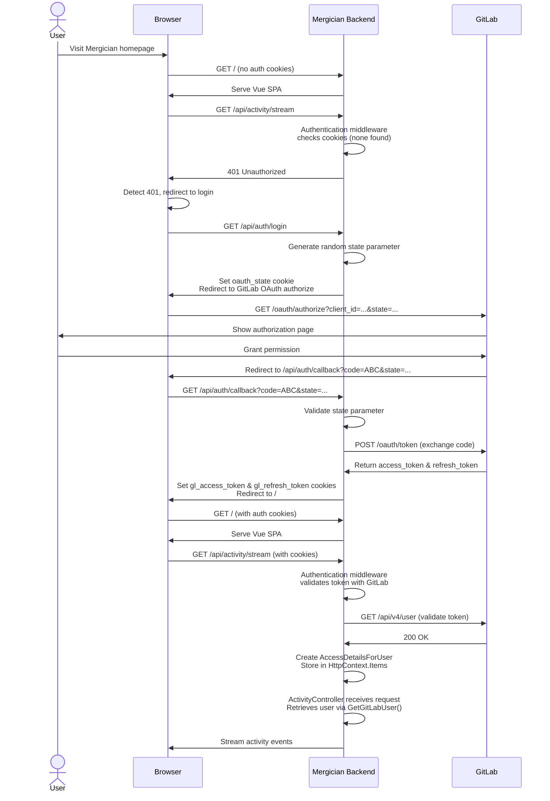
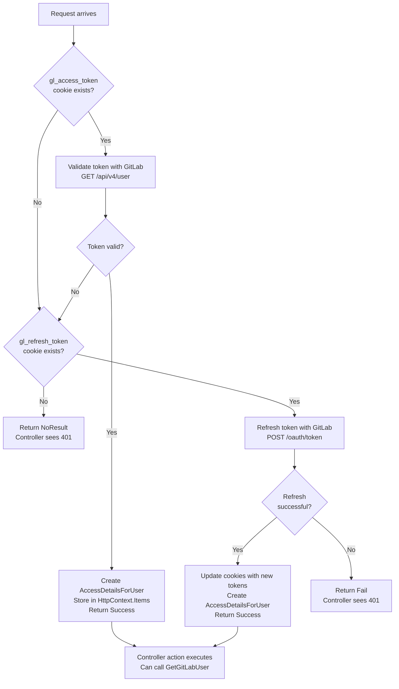

# Authentication

Mergician uses **GitLab OAuth 2.0** for authentication. There is no separate user management system—users authenticate with their GitLab credentials, and Mergician makes API calls to GitLab on their behalf using OAuth access tokens.

## Overview

When an unauthenticated user visits Mergician, the backend detects the missing authentication tokens and returns `401 Unauthorized`. The frontend then redirects the user to GitLab's OAuth authorization page. After the user grants permission, GitLab redirects back to Mergician with an authorization code. Mergician exchanges this code for an access token and refresh token, stores them securely in HTTP-only cookies, and redirects the user to the dashboard.

On subsequent requests, ASP.NET Core's authentication middleware automatically validates the access token by making a test API call to GitLab. If the token has expired, the middleware transparently refreshes it using the refresh token and updates the cookies—all without the user or controller code needing to be aware of this. Controllers simply use the `[Authorize]` attribute and retrieve the authenticated user context via `HttpContext.GetGitLabUser()`.

## Authentication Flow



### Step-by-Step Breakdown

1. **User visits Mergician**: The browser loads the Vue SPA, which immediately tries to fetch dashboard data via `GET /api/activity/stream`.

2. **No authentication cookies**: The ASP.NET Core authentication middleware (`GitLabCookieAuthenticationHandler`) runs before the controller. It looks for `gl_access_token` and `gl_refresh_token` cookies but finds none.

3. **401 Unauthorized returned**: The authentication middleware returns `AuthenticateResult.NoResult()`, and because the `ActivityController` has the `[Authorize]` attribute, ASP.NET automatically converts this to a `401 Unauthorized` response.

4. **Frontend redirects to login**: The Vue app detects the 401 status and redirects the browser to `/api/auth/login`.

5. **OAuth authorization starts**: The `AuthController.Login` endpoint:
   - Generates a random `state` parameter (used to prevent CSRF attacks)
   - Stores it in a temporary `oauth_state` cookie (expires in 10 minutes)
   - Redirects the browser to GitLab's OAuth authorization URL with:
     - `client_id`: The OAuth application ID
     - `redirect_uri`: Where GitLab should redirect after authorization
     - `state`: The random token for CSRF protection
     - `scope`: Requested permissions (`read_user read_api`)

6. **User authorizes on GitLab**: GitLab shows the user an authorization page. If the user grants permission, GitLab redirects back to the callback URL.

7. **Authorization callback**: GitLab redirects the browser to `/api/auth/callback?code=ABC&state=XYZ`. GitLab includes a short-lived, single-use authorization "code" in this redirect. The `AuthController.Callback` endpoint:
  - Validates that the `state` parameter matches the cookie (CSRF protection)
  - Reads the `code` from the query string. This `code` is an authorization code (not an access token) and must be exchanged server-side using the application's `client_secret`.
  - Exchanges the authorization `code` for tokens via `POST /oauth/token` to GitLab (server-to-server request)
  - Receives an `access_token` (short-lived, used for API calls) and `refresh_token` (long-lived, used to obtain new access tokens)
  - Stores both tokens in HTTP-only, SameSite=Lax cookies with 30-day expiry
  - Redirects the browser back to `/` (the homepage)

Important notes about the authorization `code`:
- The code is single-use and short-lived. Attempting to reuse it or exchange it client-side (in the browser) will fail.
- The exchange must happen on the server because it requires the OAuth `client_secret`, which must never be exposed to the browser or stored in client-side code.

8. **Authenticated requests**: On subsequent requests, the authentication middleware:
   - Reads the `gl_access_token` cookie
   - Validates it by making a test call to `GET /api/v4/user` on GitLab
   - If valid, creates an `AccessDetailsForUser` object and stores it in `HttpContext.Items`
   - If invalid but a `gl_refresh_token` exists, transparently refreshes the token and updates the cookies
   - If both tokens are invalid or missing, returns `NoResult()` which triggers a 401 for `[Authorize]` endpoints

## ASP.NET Core Authorization Integration

Mergician leverages ASP.NET Core's built-in authentication and authorization middleware to automate token validation. Here's how it works:

### Authentication Handler

The `GitLabCookieAuthenticationHandler` is a custom authentication handler registered at startup in [Program.cs](../src/be/Mergician/Program.cs):

```csharp
builder.Services.AddAuthentication(GitLabCookieAuthenticationHandler.SchemeName)
    .AddScheme<AuthenticationSchemeOptions, GitLabCookieAuthenticationHandler>(
        GitLabCookieAuthenticationHandler.SchemeName, null);
builder.Services.AddAuthorization();
```

This handler runs **before every controller action** (when `app.UseAuthentication()` is called in the middleware pipeline). It:

1. Checks for `gl_access_token` in the request cookies
2. Validates the token by calling `GET /api/v4/user` on GitLab
3. If valid: Creates an `AccessDetailsForUser` object and stores it in `HttpContext.Items`, then returns `AuthenticateResult.Success()`
4. If invalid but `gl_refresh_token` exists: Calls GitLab's token refresh endpoint, updates the cookies, and returns success
5. If no valid tokens: Returns `AuthenticateResult.NoResult()`

#### What `AuthenticateResult.NoResult()` means and `HttpContext.Items`

`AuthenticateResult.NoResult()` indicates the authentication handler did not authenticate the request (no valid credentials were found) and did not produce a failure that should be challenged immediately. In practice this means:

- The request continues through the middleware pipeline as an *unauthenticated* request (no principal is set).
- If the target controller or action is protected with `[Authorize]`, ASP.NET Core's authorization middleware will convert the lack of an authenticated principal into a `401 Unauthorized` (or a challenge for interactive schemes). This is why the frontend sees a `401` and then redirects to `/api/auth/login`.

Conversely, when the `GitLabCookieAuthenticationHandler` successfully authenticates a request it does two things:

- It returns `AuthenticateResult.Success()` so the runtime considers the request authenticated.
- It creates an `AccessDetailsForUser` and stores it in `HttpContext.Items[GitLabCookieAuthenticationHandler.GitLabAccessUserKey]` for use by controllers and services.

Because `[Authorize]` prevents controller actions from running for unauthenticated requests, any controller action that is executed under `[Authorize]` can rely on `HttpContext.GetGitLabUser()` returning a non-null `AccessDetailsForUser`. If you call `HttpContext.GetGitLabUser()` from an endpoint that is *not* protected by `[Authorize]`, you must still check for `null` because the request may be unauthenticated.



### Controller Usage

Controllers simply:
1. Add the `[Authorize]` attribute to the class or method
2. Retrieve the authenticated user context via `HttpContext.GetGitLabUser()`

Example from [ActivityController.cs](../src/be/Mergician/Controllers/ActivityController.cs):

```csharp
[Authorize]
[ApiController]
[Route("api/[controller]")]
public class ActivityController : ControllerBase
{
    [HttpGet("stream")]
    public async Task StreamPushActivity(CancellationToken cancellationToken)
    {
        var currentUser = HttpContext.GetGitLabUser()!;
        // Use currentUser to make GitLab API calls
    }
}
```

The `GetGitLabUser()` extension method simply retrieves the `AccessDetailsForUser` object that the authentication handler stored in `HttpContext.Items`.

### AccessDetailsForUser

The `AccessDetailsForUser` class wraps the access token and provides a convenient `CreateRequest()` method for making authenticated API calls to GitLab:

```csharp
public class AccessDetailsForUser
{
    private readonly string _accessToken;
    private readonly string _apiBaseUrl;

    public HttpRequestMessage CreateRequest(HttpMethod method, string path)
    {
        var url = $"{_apiBaseUrl}/{path.TrimStart('/')}";
        var request = new HttpRequestMessage(method, url);
        request.Headers.Authorization = new AuthenticationHeaderValue("Bearer", _accessToken);
        return request;
    }
}
```

Services like `GitLabService` receive an `AccessDetailsForUser` and use it to create authenticated requests without needing to know about cookie management or token storage.

## Token Storage & Management

Tokens are stored in HTTP-only cookies to prevent JavaScript access (XSS protection):

| Cookie Name | Contents | Purpose |
|-------------|----------|---------|
| `gl_access_token` | GitLab OAuth access token | Short-lived token for API calls (typically 2 hours) |
| `gl_refresh_token` | GitLab OAuth refresh token | Long-lived token to obtain new access tokens (typically 60 days) |
| `oauth_state` | Random CSRF token | Temporary (10 min) CSRF protection during OAuth flow |

All cookies use:
- `HttpOnly = true`: Not accessible via JavaScript
- `SameSite = Lax`: Sent on same-site requests and top-level navigation
- `MaxAge = 30 days`: Stay logged in across browser restarts
- `Path = /`: Available to all endpoints

The authentication handler transparently refreshes the access token when it expires, so users remain logged in as long as the refresh token is valid (typically 60 days, configured by GitLab).

## Configuration

Mergician requires GitLab OAuth credentials configured in `appsettings.json` or environment variables:

```json
{
  "Mergician": {
    "GitLab": {
      "Url": "https://gitlab.example.com",
      "OAuth": {
        "ClientId": "<from GitLab OAuth app>",
        "ClientSecret": "<from GitLab OAuth app>"
      }
    }
  }
}
```

**Important**: The default `appsettings.json` ships with **empty values** because Mergician is designed to work with any GitLab instance. CI Lab-specific configuration belongs in `appsettings.Development.json` or environment variables (e.g., `Mergician__GitLab__OAuth__ClientId`).

### Docker Networking Consideration

When running in Docker containers (e.g., `mergician-compose.yaml`), there's a distinction between:
- **Browser-facing URL** (`Mergician.GitLab.Url`): Where the user's browser navigates for OAuth authorization
- **Server-side URL** (`Mergician.GitLab.InternalUrl`): Where the backend container makes HTTP calls

For CI Lab, this means:
- `Url = "http://localhost:8081"` (users access GitLab in their browser)
- `InternalUrl = "http://gitlab:8081"` (Mergician container uses Docker DNS)

The `GitLabSettings.ServerUrl` computed property automatically returns `InternalUrl` if set, otherwise falls back to `Url`. All server-side OAuth and API calls use `ServerUrl`.

## CI Lab Bootstrapping

When testing Mergician locally with CI Lab, the Bootstrap tool automatically:
1. Creates a GitLab OAuth application named "Mergician"
2. Registers redirect URIs for both `localhost:5000` (Docker) and `localhost:5173` (native Vue dev server)
3. Saves `MERGICIAN_GITLAB_OAUTH_CLIENT_ID` and `MERGICIAN_GITLAB_OAUTH_CLIENT_SECRET` to `.env`

The `mergician-compose.yaml` file reads these values and passes them to the backend container via environment variables.

## Logout

The logout flow is simple:
1. User clicks "Logout" in the AppBar
2. Frontend calls `POST /api/auth/logout`
3. Backend deletes both auth cookies
4. Frontend redirects to `/`
5. User sees the welcome page with "Sign in with GitLab" button

## Key Implementation Files

| File | Purpose |
|------|---------|
| [AuthController.cs](../src/be/Mergician/Controllers/AuthController.cs) | Login, OAuth callback, `/me`, and logout endpoints |
| [GitLabCookieAuthenticationHandler.cs](../src/be/Mergician/Services/Authentication/GitLabCookieAuthenticationHandler.cs) | ASP.NET authentication handler that validates/refreshes tokens automatically |
| [GitLabOAuthService.cs](../src/be/Mergician/Services/GitLab/GitLabOAuthService.cs) | OAuth token exchange and refresh logic |
| [AccessDetailsForUser.cs](../src/be/Mergician/Services/Authentication/AccessDetailsForUser.cs) | Wrapper for access token with helper to create authenticated requests |
| [HttpContextExtensions.cs](../src/be/Mergician/Services/Authentication/HttpContextExtensions.cs) | Extension method to retrieve authenticated user from HttpContext |
| [MergicianSettings.cs](../src/be/Mergician/Entities/MergicianSettings.cs) | Strongly-typed configuration settings |
| [Program.cs](../src/be/Mergician/Program.cs) | Authentication middleware registration |
| [HomeView.vue](../src/fe/src/views/HomeView.vue) | Dashboard UI; redirects to login on 401 |
| [AppBar.vue](../src/fe/src/components/AppBar.vue) | Displays logged-in user and logout button |
