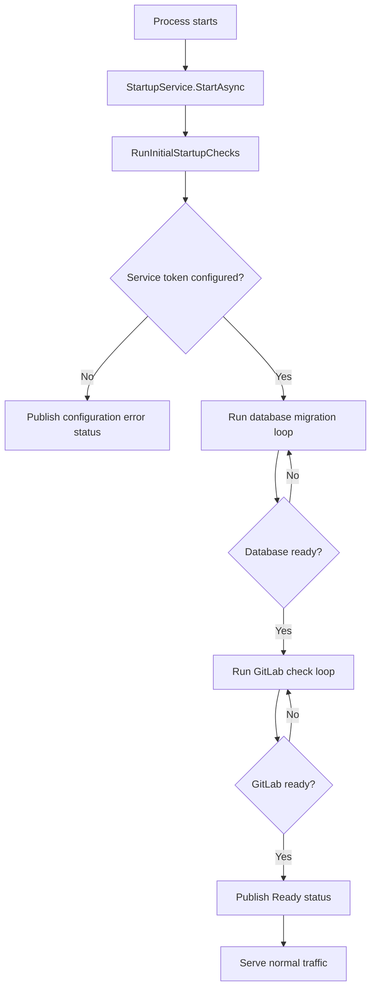
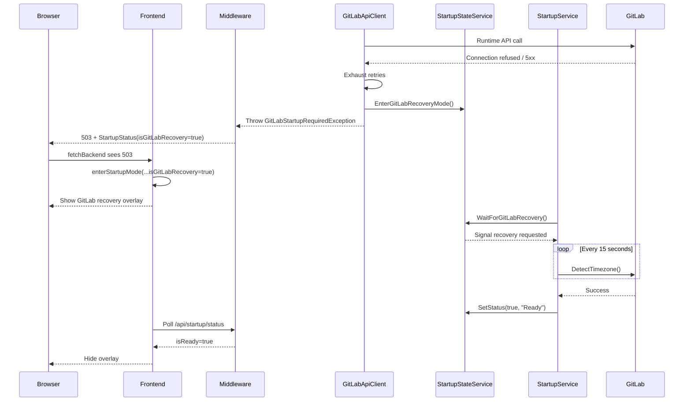

# Startup And Recovery

This document explains how Mergician moves between normal operation, cold start, and GitLab recovery mode.

## Why This Exists

Mergician depends on two external systems before it can serve useful API responses:

- PostgreSQL for persistent state
- GitLab for authentication, branch discovery, merge request status, and background synchronization

The application therefore needs two related behaviors:

- A **cold-start flow** that blocks normal API traffic until the database and GitLab are ready
- A **runtime recovery flow** that can move the app back into a safe blocked state if GitLab goes down after startup

The important design goal is consistency: existing tabs, new tabs, and background requests should all see the same state transition.

## Main Pieces

- `StartupService`: runs the cold-start checks and later waits for runtime recovery requests
- `StartupStateService`: publishes the current startup status and signals when a recovery pass is needed
- `GitLabApiClient`: wraps all GitLab HTTP calls, retries transient failures, and triggers recovery mode when runtime retries are exhausted
- Startup gating middleware in `Program.cs`: blocks API requests while the app is not ready and converts runtime GitLab failures into `503` responses with startup metadata
- `GitLabCookieAuthenticationHandler`: validates GitLab OAuth cookies during normal operation but skips validation while startup or recovery is already active
- `StartupController`: exposes `/api/startup/status` so the frontend can poll the shared status
- Frontend composables `useStartupCheck.ts` and `useBackendFetch.ts`: keep the SPA synchronized with backend startup and recovery state

## Status Model

The backend publishes a `StartupStatus` payload with these key fields:

- `isReady`: whether normal API traffic should be allowed
- `message`: the user-facing startup or recovery message
- `error`: optional detail for failure states
- `isGitLabRecovery`: distinguishes a runtime GitLab outage from a normal cold start

That last flag is what lets the frontend show a dedicated GitLab recovery overlay instead of the generic “Mergician is starting up” box.

## Cold Start Flow

On process start, `StartupService` runs three phases in order:

1. Validate required configuration, especially the GitLab service token.
2. Run database migration until it succeeds.
3. Probe GitLab by calling `GitLabTimezoneService.DetectTimezone()` until GitLab responds successfully.

Only after all three succeed does the service publish `isReady = true`.

While the app is not ready, the startup middleware returns `503 Service Unavailable` for normal API routes together with the current `StartupStatus` payload.

## Runtime GitLab Recovery Flow

After startup succeeds, runtime GitLab failures are handled differently from cold start.

### 1. A GitLab call fails repeatedly

All GitLab HTTP calls go through `GitLabApiClient`. Its retry loop treats connection failures and `5xx` responses as transient, but after the retry budget is exhausted it does two things:

1. Publishes GitLab recovery mode via `StartupStateService.EnterGitLabRecoveryMode()`
2. Throws either `GitLabStartupRequiredException` or `GitLabApiFailureException`, depending on the caller

This means the first hard runtime failure becomes the single system-wide transition point into recovery mode.

### 2. Other in-flight callers stop retrying

Once recovery mode is active, `GitLabApiClient` checks `StartupStateService.IsInGitLabRecoveryMode` before each next retry delay. If another request already proved GitLab is down, the current request stops retrying immediately.

That avoids multiple threads spending another full retry budget against an already known-down GitLab instance.

### 3. Middleware turns the failure into a startup-style response

The startup gating middleware in `Program.cs` catches `GitLabStartupRequiredException` and returns:

- `503 Service Unavailable`
- the latest `StartupStatus` payload, including `isGitLabRecovery = true`

That same middleware also blocks subsequent API calls while `isReady` is false, so once recovery mode is active the rest of the app sees a consistent startup-style response instead of a mixture of `401`, `500`, and stale data.

### 4. Existing tabs and new tabs converge on the same UI

- **Existing tabs** detect the `503` from `fetchBackend()` and call `enterStartupMode()`.
- **New tabs** call `/api/startup/status` during initial app load and get the same recovery payload.

Both paths end up with the same frontend state, so both show the GitLab recovery overlay.

### 5. Background recovery loop waits and retries

`StartupService` waits on `StartupStateService.WaitForGitLabRecovery()`. When signalled, it re-runs the GitLab checks only.

Recovery polling uses a slower `15s` delay rather than the cold-start `5s` loop. This keeps the system responsive without hammering a down GitLab server.

### 6. Ready state is restored

Once a recovery GitLab check succeeds, `StartupService` publishes `isReady = true` again. `StartupStateService.SetStatus(true, ...)` also clears `isGitLabRecovery`, returning the app fully to normal operation.

## Frontend Behavior

The frontend uses two small composables to keep recovery handling centralized.

### `useStartupCheck.ts`

This composable owns the shared SPA-level startup state:

- Starts a single poll loop against `/api/startup/status`
- Stores `isReady`, `message`, `error`, and `isGitLabRecovery`
- Redirects the user back to the dashboard when a restart or recovery starts while they were already on another route
- Preserves the GitLab recovery message if a later status poll fails while recovery is already active

### `useBackendFetch.ts`

This composable wraps normal API calls:

- If the app is already known to be not ready, it short-circuits the request
- If it receives a `503` with a startup payload, it enters startup mode using the backend-provided status
- If the request fails without structured startup data, it falls back to a generic restart message

That keeps view components simple. They only need to stop their own local polling when they receive a `StartupRequiredError`.

## Authentication During Recovery

Authentication deserves special treatment because validating a GitLab access token normally requires calling GitLab.

During startup or recovery, `GitLabCookieAuthenticationHandler` checks the shared startup status first. If the app is not ready, it returns `AuthenticateResult.NoResult()` instead of contacting GitLab.

This exists to protect `/api/startup/status` and similar non-authorized routes from accidentally making more GitLab traffic while recovery is already active.

For normal authorized API routes, the startup middleware sits earlier in the pipeline and blocks the request with a `503` before the request reaches controllers.

## Why There Are Both `503` Responses and a `200` Status Endpoint

This split is intentional:

- `/api/startup/status` must stay readable even while the app is blocked, so the frontend can discover the current state
- other API routes return `503` while blocked so view-specific code knows to stop normal activity and hand control back to the global startup overlay

Without this separation, existing tabs and new tabs would diverge.

## Practical Debugging Notes

When debugging startup or recovery issues, these are the most useful places to inspect:

- Mergician container logs for `GitLabStartupRequiredException`, `GitLabApiFailureException`, and startup middleware log entries
- `/api/startup/status` responses to confirm `isReady` and `isGitLabRecovery`
- frontend console logs from `useStartupCheck.ts` and `useBackendFetch.ts`
- whether GitLab calls are using `GitLab.ServerUrl` correctly from inside the container environment

## Expected User Experience

When everything is working correctly:

- Cold start shows a startup overlay until database and GitLab checks pass
- If GitLab goes down while the app is running, existing tabs transition from the dashboard into the GitLab recovery overlay
- New tabs opened during the outage immediately show the same GitLab recovery overlay
- The backend stays alive during the outage and keeps serving startup/recovery status
- Once GitLab is healthy again, the overlay disappears and normal dashboard polling resumes