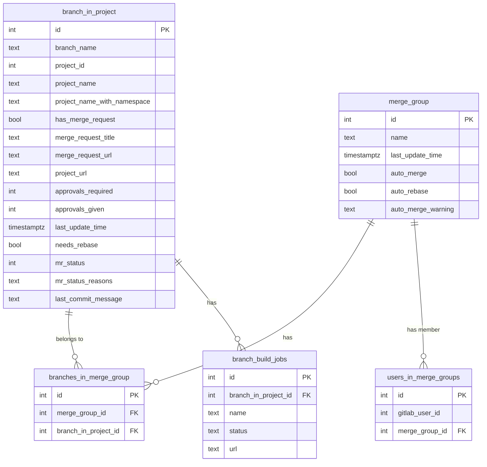

# Database Schema

This document describes the Mergician database schema using an entity-relationship diagram.

## Table Descriptions

| Table | Description |
|---|---|
| `branch_in_project` | A tracked branch within a specific GitLab project, including its current MR status, approval state, and build details. |
| `merge_group` | A named group of related branches across projects that should be merged together. |
| `branches_in_merge_group` | Join table linking branches to merge groups. |
| `users_in_merge_groups` | Tracks which GitLab users are subscribed to which merge groups, used to scope activity polling per user. |
| `branch_build_jobs` | CI/CD pipeline job results for a branch (one row per job on the latest pipeline). |

## Key Constraints

- `branch_in_project`: unique on `(branch_name, project_id)`
- `merge_group`: unique on `name`
- `branches_in_merge_group`: unique on `(merge_group_id, branch_in_project_id)`
- `users_in_merge_groups`: unique on `(gitlab_user_id, merge_group_id)`
